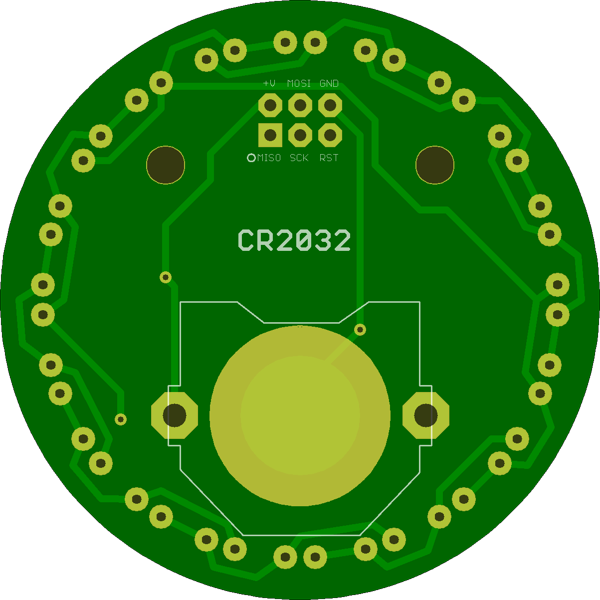

## Icosa Stella Medallion

A version of this board was the first PCB I had manufactured, and the surface mount soldered the ATtiny85 and button to. 

This design is still my favorite for wearables, and has inspired may of my other 20 LED ATtiny85 Charlieplex boards. 

## IcosaStellaMedallion 

### Board dimensions

* (200000, 200000) original units
* (2.0000, 2.0000) inches
* (50.8000, 50.8000) mm

| Front | Back |
| --- | --- |
|  |  |

